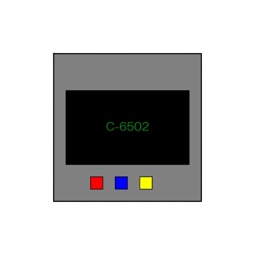

# C-6502 

[🇵🇹 Português](#português) | [🇺🇸 English](#english)

---

## 🇵🇹 **Português**
### Sobre o Projeto
O **C-6502** é um emulador do microprocessador 6502, desenvolvido para auxiliar estudantes e entusiastas da programação de baixo nível.

### 📥 Download
A versão mais recente pode ser descarregada [aqui](https://github.com/DeepDish36/C-6502/releases/latest).

### 🛠 Como Contribuir
Se quiseres ajudar no desenvolvimento, visita o repositório e segue as instruções para contribuir!

🔗 [Código Fonte](https://github.com/DeepDish36/C-6502)

### 📜 Licença
Este projeto está licenciado sob **GNU Affero General Public License v3.0**, garantindo que qualquer melhoria seja pública e que o autor receba crédito.

---

## 🇺🇸 **English**
### About the Project
**C-6502** is an emulator for the 6502 microprocessor, designed to assist students and enthusiasts in learning low-level programming.

### 📥 Download
The latest version can be downloaded [here](https://github.com/DeepDish36/C-6502/releases/latest).

### 🛠 How to Contribute
If you want to help develop the project, visit the repository and follow the contribution guidelines!

🔗 [Source Code](https://github.com/DeepDish36/C-6502)

### 📜 License
This project is licensed under **GNU Affero General Public License v3.0**, ensuring that any improvements remain public and that the original author is credited.

---

  

